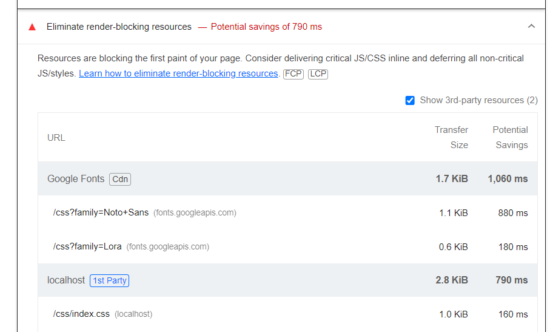
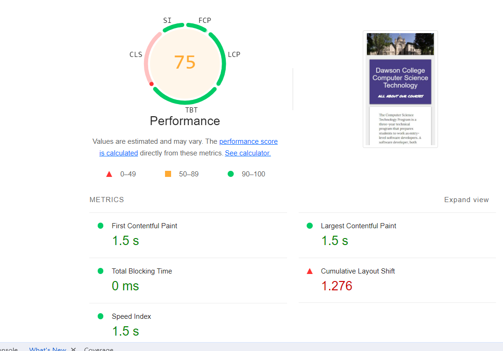
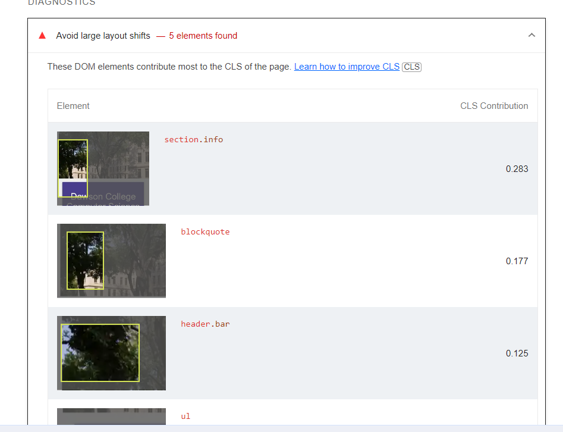
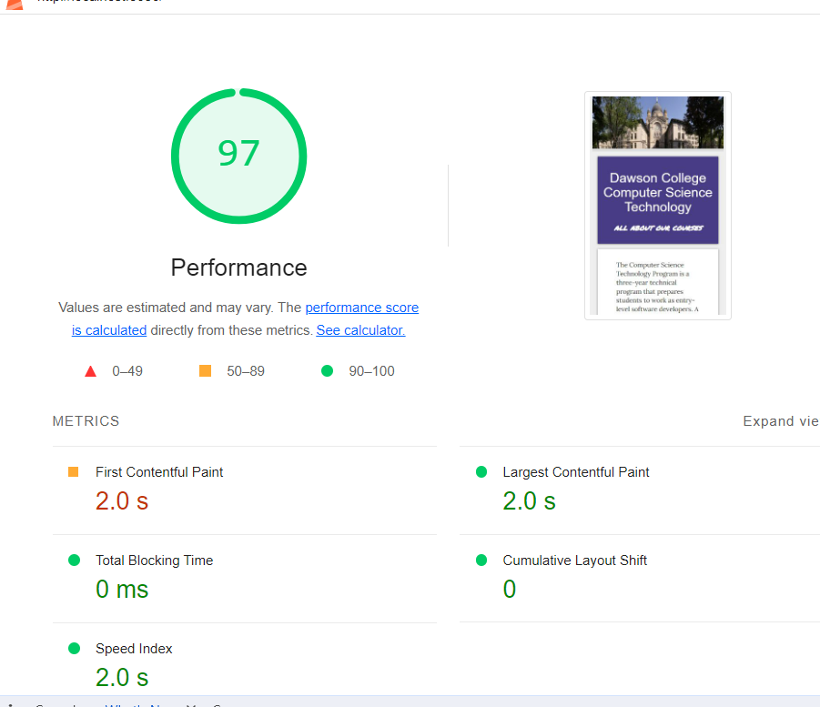

# Course List SPA

Vanilla JS application showing Dawson CS Course List. Contains lots of bad code and performance issues
for students to fix. Also good practice for configuring CI and deployment.

Webpack bundling and other configuration based on https://html5boilerplate.com/ 

See package.json scripts to how to serve in development and build for production.

Adapted from 2021-2022 520 assignments by Jaya Nilakantan.

# Performance Improvements

## 1 - Resize images

By resizing and converting images to WebP format, the image load is faster due to compression type and 
WebP typically provides superior compression compared to JPEG and PNG. This results in smaller file sizes for images without significant loss of quality. Smaller file sizes contribute to faster webpage loading times, reduced bandwidth usage, and improved user experience, particularly on websites with large image content.

## 2 - Reusing description section in DOM

Creating and destroying DOM elements is a relatively expensive operation because it involves memory allocation and deallocation. Therefore, reusing an existing element is more efficient in performance, especially if it is frequently toggled between visible and hidden states. This is because the browser doesn't have to allocate new memory for each element.
Also, manipulating the DOM by creating or removing elements can trigger reflows and repaints, which can be performance-intensive. Reusing elements allows to change their visibility without triggering these costly operations, leading to a smoother user experience.

## 3 - Preload CSS files

With lighhouse generated performance report in mobile view, I saw that fonts and css files loading was blocking the page rendering. So I added preload to css files in order to prevent the page rendering block.

By preloading css, the browser fetches critical resources early in the page loading process. It reduces the overall page load time by ensuring that important styles and fonts are available as soon as possible.Fetching stylesheets and fonts with preload helps minimize render-blocking, as the browser can begin downloading and processing these resources without waiting for the HTML parser to reach the corresponding <link> elements. This can result in faster rendering and improved user experience.

After adding preload, the performance improved by 10% at least and I saw no more render-block issue caused by fonts and css links in new lighhouse generated performance report.

## 4 - Ensure text remains visible during webfont load

I added display="swap" to font links. When a web page loads, the browser must download and apply fonts before rendering text in that font. Without display=swap, the text might remain invisible or use a fallback font until the custom font is downloaded. With display=swap, the browser displays text in a system font or fallback font immediately. Once the custom font is downloaded, it's applied to the text, resulting in faster text rendering and a better user experience.

## 5 - Optimize Cumulative Layout Shift

I inserted the banner image into a div with setted width and height attributes, serving as a placeholder for the image with the desired aspect ratio. This ensures that the space is reserved for the image, preventing layout shifts when the image loads. After removing 5 huge layout shifts, the performance drastically increased. 

