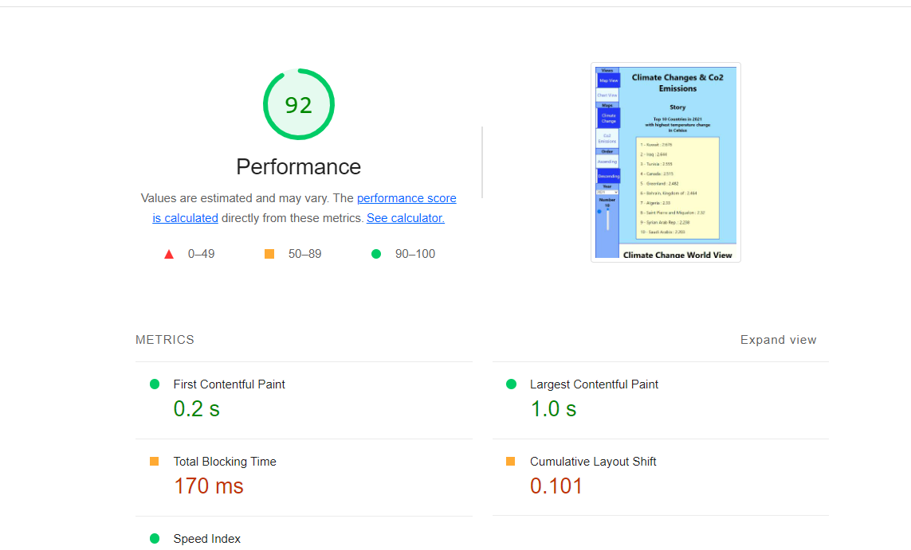
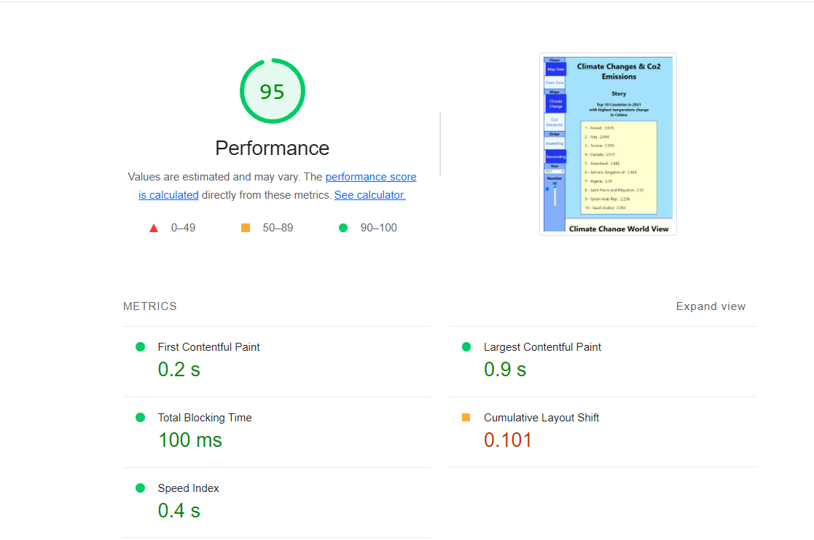
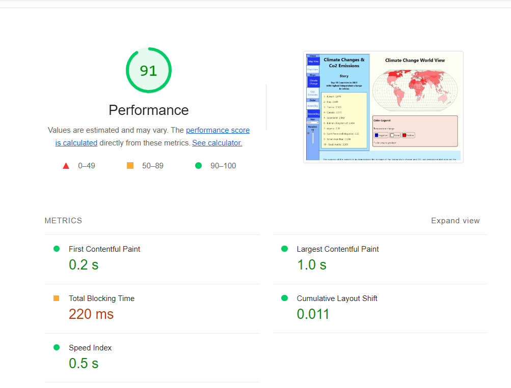
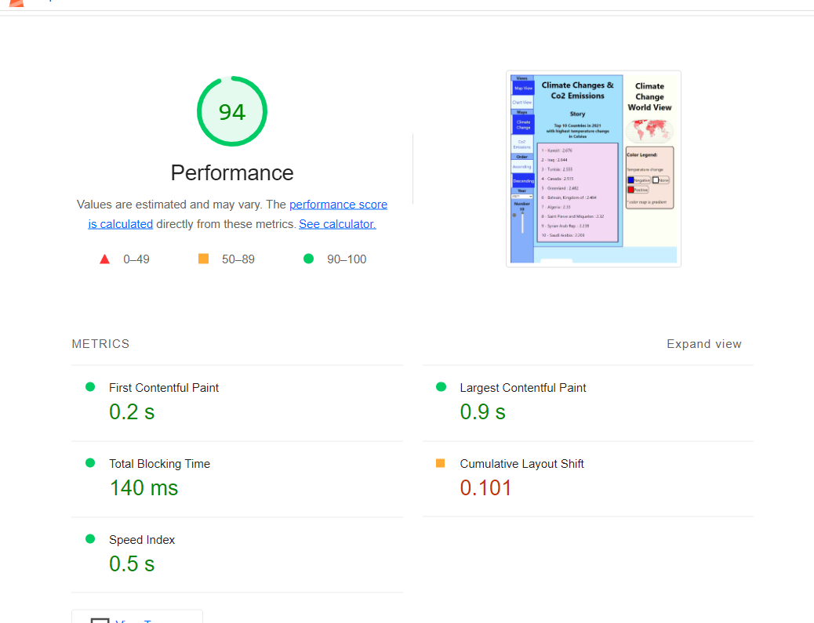
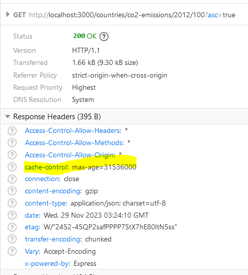

# Performance of Climate Change and CO₂ Gaz Emission in the World

## Introduction and Methodology

We gathered data about app performance using mainly chrome, lighthouse, webpagetest.org. When gathering these data, Mohamed used his laptop on windows 11 and chrome(Version 119.0.6045.160), Shuya used her laptop on windows 11 on Edge version 119.0.2151.72, Firefox version 120.0 (64-bit) and chrome version 119.0.6045.161 and Anastasia used her laptop on windows 11 on Edge version 119.0.2151.93 (Official build) (64-bit), Firefox version 118.0b3 (64-bit) and chrome version 119.0.6045.161 (Official Build) (64-bit)

Before the first improvements the website cost 0.06$ and would weight 0.46MB
After those improvements the website now costs 0.05$ and weight 0.44MB

## Areas to Improve
* Speed Improvement (Blocking Time, Paint...)
- Blocking Time Reduction: Dive into minimizing render-blocking resources like CSS and JavaScript to enhance initial page load.
* CSS optimization
- Reducing Unused Selectors & Properties: Analyze the CSS to remove any unused selectors or properties that could be impacting performance.
* Text Compression
* Lazy-Load Image
* Caching
- HTTP Caching Headers: Leverage techniques like setting Cache-Control headers to allow browsers to store resources locally and reduce unnecessary requests.
- Local Storage Caching: Store frequently accessed data in the browser's local storage to minimize server requests for static content.
- Database Caching: Implement caching strategies within the database layer to cache frequently queried data, reducing database load.

## Summary of Changes 

The website underwent several performance optimizations with impactful outcomes:

*The introduction of image lazy loading prioritized the loading of critical content, improving user interaction by allowing quicker access to the visible part of the page. 

*Server compression significantly reduced Total Blocking Time by minimizing data transfer over the network, resulting in faster load times. 

*Local storage caching reduced server requests, enhancing loading times and overall responsiveness. Utilizing local storage caching resulted in enhanced page responsiveness by accelerating the retrieval of data stored in the local storage, leading to a quicker user experience. 

*The implementation of server-side database caching led to a remarkable improvement in data retrieval speed, reducing fetch time from 52ms to 0ms. 

*However, efforts to optimize externally-referenced CSS files were unsuccessful, indicating a need for further refinement with additional time and resources. The expectation was to see an improvement in the rendering of the page by optimizing the handling of CSS files.The optimization strategy involved creating a separate CSS file for non-critical styles (non-critical.css) and implementing a deferred link to this file in the HTML. Overall, these changes collectively contributed to a more efficient and responsive user experience.

### Image Lazy Load

Lead: Anastasia Bondarenko

When image rendering is lazy loaded, the web prioritizes the loading of critical content (above-the-fold) first, allowing users to interact with the visible part of the page more quickly. Images that are not immediately visible do not impact the initial page load time.

Network fetch image is not failing when rendering the footer after the image was lazy loading, because it renders footer first and adds image when its fully loaded.

### Server Compression

Lead: Anastasia Bondarenko

Compressed content requires less bandwidth, resulting in potential cost savings, especially if your hosting service charges based on data transfer. Compression reduces the size of files (such as HTML, CSS, JavaScript, and images) before they are sent to the client. Smaller files mean faster download times, particularly beneficial for users on slower or limited internet connections.

Total Blocking Time in Lighthouse measures the total amount of time during which the main thread of a web page is blocked and unable to respond to user input. 

The blocking time is lower after server compression because server compression reduces the amount of data that needs to be transferred over the network. When a web page is requested, the server compresses the response before sending it to the client (browser), and the client then decompresses the response to render the page. This compression reduces the size of the data being transferred, resulting in faster load times and reduced blocking on the main thread.

In the first image, blocking time is 170ms, and after server compression it is 100ms, which is a big improvement for page rendering. 

### Requests & Local Storage Caching

Lead: Shuya Liu

Local storage caching on the website reduces requests to the server, improves loading times and responsiveness. By adding Cache-Control headers to APIs it reduces unnecessary requests to the server and enhancing the overall performance and speed of the system. It also boosts our site's speed and user experience by minimizing network traffic and providing faster access to cached data.

Initial requests and data cached before running light house

### Implement Caching Database

Lead: Mohamed Loutfi

Caching on the server-side database optimizes performance by minimizing redundant queries, reducing server load, and accelerating data retrieval, resulting in improved website responsiveness and a more efficient user experience.

As you can see, before it would take 52ms and it now takes 0ms

## CSS Optimization (was not able to fix it)

Lead: Mohamed Loutfi

I attempted to address the issue of externally-referenced CSS files blocking page rendering by implementing a common optimization technique. To do this, I created a CSS file (non-critical.css) in the 'public/' directory containing non-critical styles that could potentially block page rendering due to their size. Then, I included a deferred link to this CSS file in the HTML file (index), also located in the 'public/' directory. In my efforts to identify non-critical styles, I utilized the coverage tool. However, despite these optimizations, the performance test results still indicate that two externally-referenced CSS files are blocking page rendering: '/non-critical.css' and '/static/css/main.55ecedf3.css'. With more time and resources, further refinement of optimization strategies could be achievable to effectively address this opportunity of externally-referenced CSS files blocking page rendering.

## Conclusion

In summary, our website performance improvements were notably driven by server-side enhancements, including server compression, and local storage and database caching. These changes contributed to faster load times, reduced blocking, and an enhanced user experience. We still had challenges with externally-referenced CSS files. Through these changes, we also understood the central role of server optimizations in achieving significant performance gains and it pushes us to stay committed to improving our product's performance.