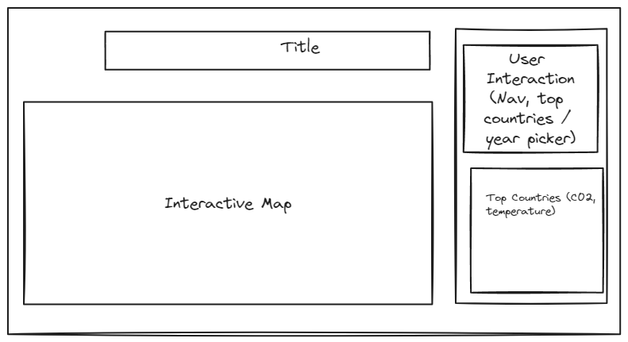
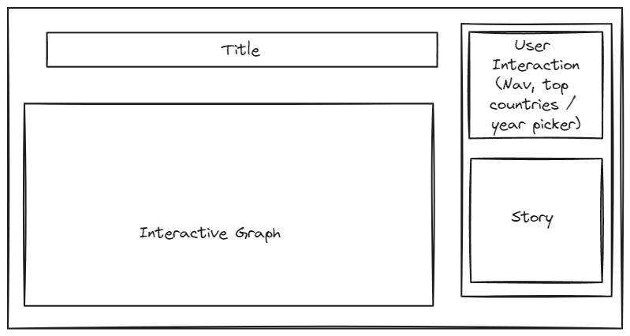

## Data

#CO2 emmissions per country measured in million tonnes 1850-2021
https://github.com/owid/co2-data/blob/master/owid-co2-data.csv

#Temperature change per country
https://climatedata.imf.org/datasets/4063314923d74187be9596f10d034914/explore

## API
Top countries with the highest temperature change (Default descending)
- GET /countries/temperature-change/{NumberOfCountries}{asc?=true}

Top countries with the highest emissions of CO2 (Default descending)
- GET /countries/co2-emissions/{NumberOfCountries}{asc?=true}

Comparison between temperature change and emissions of CO2 of countries
- GET /countries/comparison/{NumberOfCountries}

The temperature change of one specific country
- GET /countries/temperature-change/{country}

The CO2 emissions of one specific country
- GET /countries/co2-emissions/{country}

Comparison between temperature change and emissions of c02 of one specific country
- GET /countries/comparison/{country}

## Visualizations
The visualization's primary objective is to educate and raise awareness about the impact of CO2 emissions on global temperatures. This educational tool aims to inform the user about the relationship between CO2 levels and temperature changes, highlighting the critical issue of climate change. The story we want to convey with this data is the cause-and-effect relationship between increasing CO2 emissions and rising global temperatures.

## Views
1st view:

2st view:

As you can see on both views we should not really have something going blow the fold (except for the mobile version where we would have the map and under it the "story" (1st view) and the graph and un ser it the "story" (2nd view))

## Functionality

UI controls
- Buttons to navigate between Map view and Chart view
- Range slider for years
- Number slider for number of countries, temperature change and CO2 emission
- Radio buttons for ascending or descending (default descending)
- Search function to display specific country
- Zoom in map view

## Features and Priorities

Priorities:
- Views (Map and Chart)
- UI controls
- stories

Features:
- slider for temperature change and CO2
- Search function

## Dependencies

Choropleth World Map - View 1
- react-jvectormap
https://allegra9.medium.com/react-world-map-75aceda9cc48

Graph Temperature Change and CO2 Emissions - View 2
- recharts
https://www.npmjs.com/package/recharts

If one of the above does not work, for both views:
- nivo
https://medium.com/codex/add-charts-into-our-react-app-with-nivo-map-choropleth-chart-42d80d4d1a37
https://nivo.rocks/

React Libraries Source:
https://technostacks.com/blog/react-chart-libraries/
